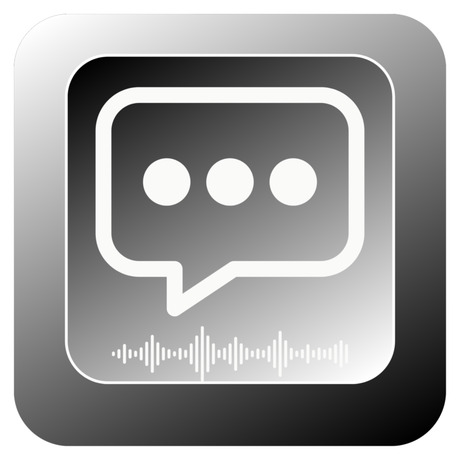

<p align="center">
  
</p>

# Hold to Talk

Free, open-source voice dictation for macOS. Hold a key, speak, release — your words appear wherever your cursor is. Your audio stays local and safe on your Mac.

- **Free and open-source** — no subscription, no paywall, no black box. Inspect the code, build it yourself, or install a signed release.
- **Local and safe** — powered by [WhisperKit](https://github.com/argmaxinc/WhisperKit), transcription runs entirely on Apple Silicon via Core ML. No cloud upload, no accounts, no in-app tracking.
- **Fast on-device AI** — optimized for low-latency dictation with high-performance on-device speech models, plus optional Apple Intelligence cleanup when available.
- **Works everywhere** — dictate into any app: Slack, Notes, your IDE, email, browser — anywhere you can type.
- **Apple Intelligence cleanup** (optional) — on-device grammar and filler-word removal with a customizable prompt. Requires macOS 26+.
- **Auto-updates** — direct downloads update in-app via [Sparkle](https://sparkle-project.org).
- **Stays out of your way** — lives in your menu bar. Hold a key to record, release to paste. That's it.

<p align="center">
  <a href="https://jxucoder.github.io/hold-to-talk/demo.mp4">
    
  </a>
</p>

<p align="center">
  <a href="https://jxucoder.github.io/hold-to-talk/demo.mp4">Watch the demo video</a>
</p>

## Install

**Requirements:** macOS 15+, Apple Silicon.

### Download pre-built binary

Grab the latest notarized `DMG` or `ZIP` from [GitHub Releases](https://github.com/jxucoder/hold-to-talk/releases), install `HoldToTalk.app` into `/Applications`, and open it.

### Homebrew

```bash
brew install jxucoder/tap/holdtotalk
```

### First launch

On first launch, Hold to Talk will guide you through:

1. Granting **Microphone**, **Accessibility**, and **Input Monitoring**
2. Downloading the selected Whisper model if it is not already present
3. Warming up the active model; the first transcription after launch or after switching models may be slightly slower

### Build from source

Requires Xcode command line tools.

```bash
git clone https://github.com/jxucoder/hold-to-talk.git
cd hold-to-talk
make build
make install   # installs HoldToTalk.app to /Applications
make run
```

Or open `Package.swift` in Xcode and run.

### Packaging (signed release)

```bash
# Local packaging (ad-hoc signed): creates dist/HoldToTalk-v<version>.zip + .dmg
make package

# Production release (Developer ID + notarization + stapling): creates notarized zip + dmg
SIGNING_IDENTITY="Developer ID Application: <Your Name> (<TEAMID>)" \
APPLE_ID="<apple-id-email>" \
APPLE_TEAM_ID="<team-id>" \
APPLE_APP_PASSWORD="<app-specific-password>" \
make release
```

## Usage

1. Launch — appears in menu bar as a mic icon
2. Hold **Ctrl** (default) to record
3. Release to transcribe and paste into the active window
4. Click the menu bar icon for status, last transcription, and settings

### Settings

Open via menu bar → Settings:

| Setting | Default | Options |
|---|---|---|
| Launch at Login | off | Toggle on/off |
| Transcription profile | `balanced` | `fast`, `balanced`, `best` |
| Whisper model | device-recommended | `tiny.en`, `tiny`, `base.en`, `base`, `small.en`, `small`, `medium.en`, `medium`, `distil-large-v3`, `distil-large-v3_turbo`, `large-v3_turbo`, `large-v3-v20240930`, `large-v3-v20240930_turbo`, `large-v3` |
| Hotkey | Control | Control, Option, Shift, Right Option |
| Cleanup | on | Toggle on/off — uses Apple Intelligence (macOS 26+) |
| Cleanup prompt | (default) | Customizable instructions for how Apple Intelligence cleans up transcriptions |
| Diagnostic logging | off | Toggle on/off — local troubleshooting logs only; transcript text is redacted by default |

## Architecture

```
HoldToTalkApp          SwiftUI menu bar app, entry point
DictationEngine        Orchestrator: record → transcribe → cleanup → paste
AudioRecorder          AVAudioEngine mic capture, resamples to 16 kHz mono
Transcriber            WhisperKit wrapper, lazy model loading
TextProcessor          On-device text cleanup via Apple Intelligence
TextInserter           Multi-strategy text insertion (Accessibility API, keyboard events, clipboard)
HotkeyManager          NSEvent global/local monitor for modifier keys
ModelManager           Whisper model download and lifecycle management
RecordingHUD           Floating overlay showing recording state
OnboardingView         Guided setup flow for first launch
SettingsView           SwiftUI settings form
```

Dependencies: [WhisperKit](https://github.com/argmaxinc/WhisperKit) (transcription) and [Sparkle](https://sparkle-project.org) (auto-updates). Transcription runs locally with on-device AI models, and Apple Intelligence cleanup is optional and on-device as well.

## Permissions

macOS will prompt for:
- **Microphone** — required for recording
- **Accessibility** — required for text insertion and focused-app interaction
- **Input Monitoring** — required for reliable global hotkey detection

Detailed guide: [Permission System Notes](docs/permissions.md)

## Notes

- Secure text fields such as password inputs are intentionally blocked; Hold to Talk will not paste into protected fields.
- Direct downloads support in-app updates through Sparkle. App Store builds use App Store distribution instead.

## Contributing

Contributions are welcome! Please open an issue to discuss larger changes before submitting a PR.

1. Fork the repo
2. Create a feature branch (`git checkout -b my-feature`)
3. Commit your changes
4. Open a pull request

## Privacy

Hold to Talk runs entirely on your Mac — no cloud transcription service, no accounts, and no in-app tracking. Optional diagnostic logs stay local, are off by default, and redact transcript text by default. See the full [Privacy Policy](PRIVACY.md).

## License

[Apache 2.0](LICENSE)
